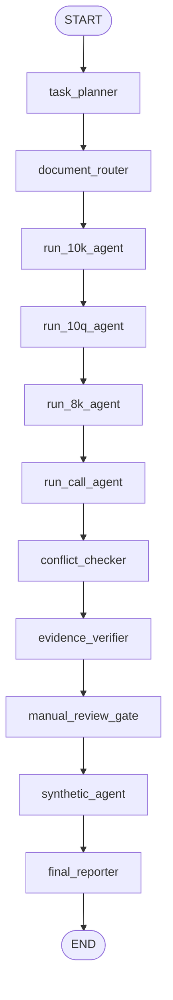

# Graph Backbone

This package contains the LangGraph orchestration backbone for disclosure-grounded analysis.

## State Model

- Runtime state: `src/app/graph/state/research_state.py`
- Canonical request and packet payloads: `src/app/domain/graph_models.py`
- Shared memory is append-only and reducer-backed so every node can publish reusable context.

## Node Flow

## Execution Notes

- `task_planner` converts the request into a deterministic `ExecutionPlan`.
- `document_router` emits `RoutedTask` records, writes the active route plan into shared memory, and records coverage gaps for unavailable or weak channels.
- form-specific agents are backed by reusable subgraphs in `src/app/graph/subgraphs/specialized_agents.py`.
- each specialized agent runs a bounded `Plan -> Retrieve -> Reason -> Reflect -> Output` loop with an iteration counter and max-iteration guard.
- form-specific agents emit `AgentOutputPacket` payloads even when they no-op.
- `conflict_checker` and `evidence_verifier` operate on accumulated shared memory and agent packets.
- `manual_review_gate` is a future interrupt insertion point; it currently runs in non-blocking mode and records pending review counts.
- `synthetic_agent` prepares the final synthesis layer.
- `final_reporter` emits the skeletal `FinalReport` object.
- `build_research_graph()` compiles with a shared checkpointer; `build_graph_invoke_config()` provides the required `thread_id` config.
- node execution is wrapped by `src/app/graph/observability.py` for node-level logs and lightweight state snapshots.
- `src/app/graph/checkpoint.py` also exposes `build_resume_config()` so the latest checkpoint for a `thread_id` can be resumed in-process during local development.
- reduced mode is triggered deterministically when the transcript channel is unavailable; `management_tone_guidance` is then marked as missing coverage instead of routed.
